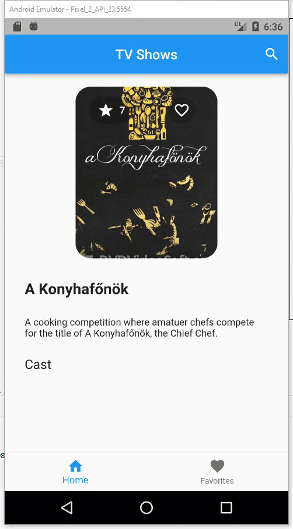
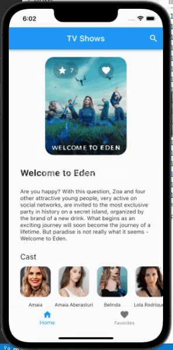
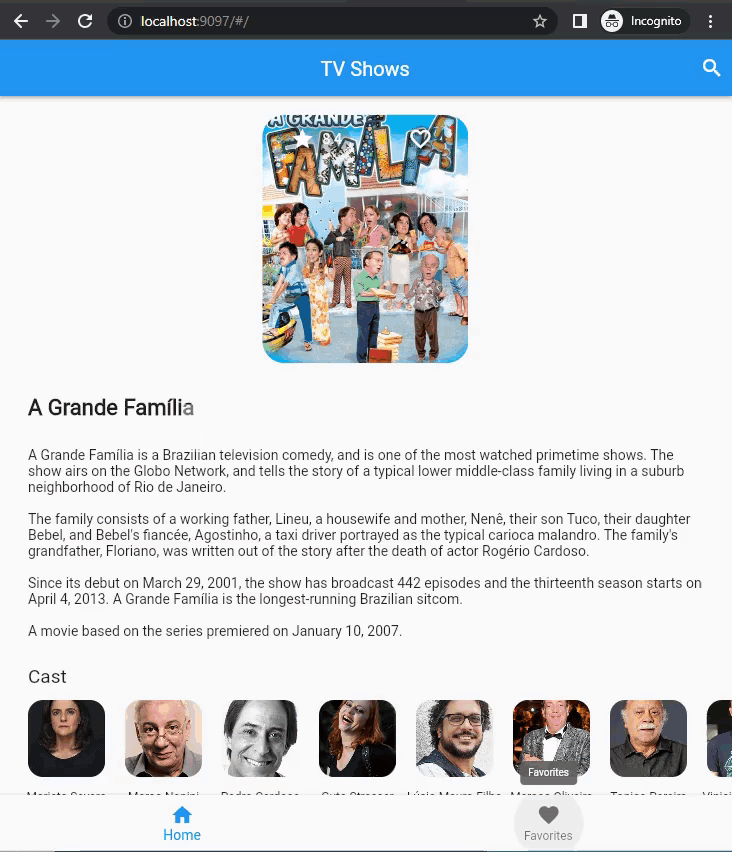

# egroup_tv_challenge

A new Flutter project.

## Getting Started

This project is a starting point for a Flutter application.

A few resources to get you started if this is your first Flutter project:

- [Lab: Write your first Flutter app](https://flutter.dev/docs/get-started/codelab)
- [Cookbook: Useful Flutter samples](https://flutter.dev/docs/cookbook)

For help getting started with Flutter, view our
[online documentation](https://flutter.dev/docs), which offers tutorials,
samples, guidance on mobile development, and a full API reference.

## Mobile

### Android



### iOS



## Web Build

Run the following commands:

```
flutter pub global activate webdev
flutter build web
```

You can find the built `HTML`/`JS`/`CSS` in `/build/web` directory of this project.

Assign the full path of this directory to the specific port (ex: `9097`) in `httpd-vhosts.conf` of `XAMPP`.

Open that port of localhost via the web browser to see the living homepage.


